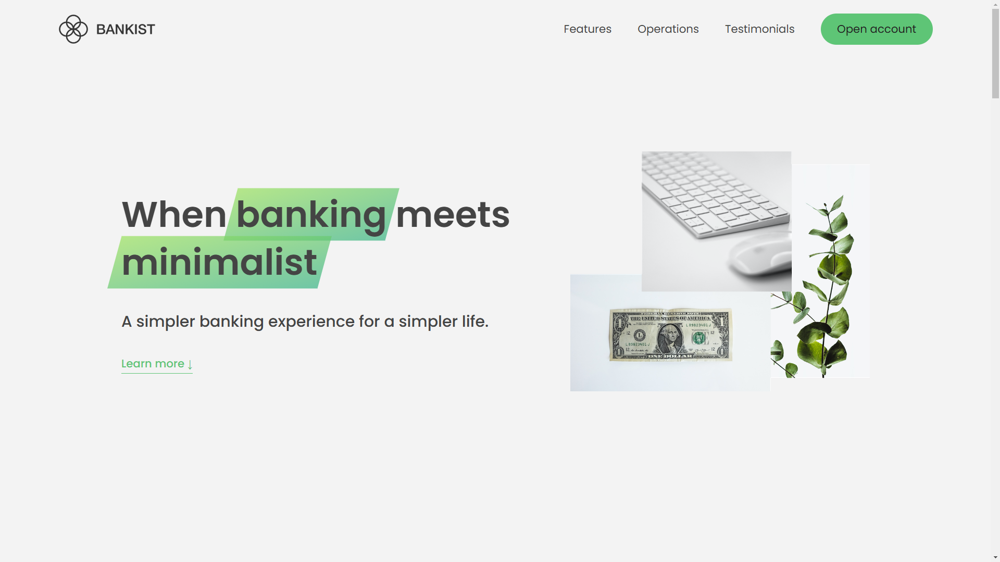

# 🌟 Bankist Website Project

## 📝 Overview

The **Bankist Website** is a showcase of a fictional digital banking platform designed for simplicity and efficiency. It demonstrates essential features of an online banking application while providing a modern, minimalist design. This project is built as a learning exercise in web development.

## 🖼️ Screenshot



---

## ✨ Features

- 🧭 **Smooth Scrolling**: Navigation with smooth scrolling effects for a seamless user experience.
- 🛠️ **Interactive UI**: Includes features such as modal windows, tabs, and dropdown menus.
- 🔑 **User Authentication (Demo)**: Simulates a basic login system.
- 💸 **Account Actions**: Simulated features like transfers, loans, and account closure.

---

## 🛠️ Technologies Used

- ⚙️ **HTML5**: For structuring the web pages.
- 🎨 **CSS3**: For styling and responsive design.
- 🧩 **JavaScript (ES6)**: For interactivity and dynamic content.

---

## ⚙️ Setup

To run the project locally:

1. **Clone the Repository**:
   ```bash
   git clone https://github.com/BothSann/bankist-website.git

---

## 👨‍💻 Built By

This project was built by **THANN SOPHEAKBOTH** as part of an online learning course by [Jonas Schmedtmann](https://codingheroes.io/).

---

## ©️ Copyright By

© Copyright by **Jonas Schmedtmann**. This project is for educational purposes only and cannot be used for commercial purposes.
